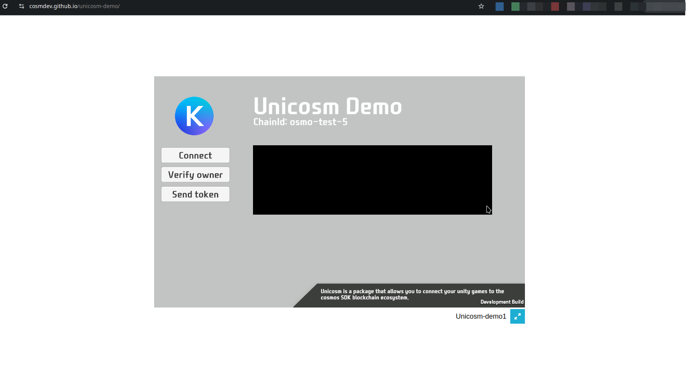

---
layout: doc
aside: false
--- 

 

Demonstration 
============

https://cosmdev.github.io/unicosm-demo/

<DividePage :top="63">
<template #left>

## Connect

In this demo, the `Connect` button uses the script: [CosmosSignerConnect.cs](/scripts/CosmosSignerConnect.cs.html)

## Verify owner

In this demo, the `Verify owner` button uses the script: [CosmosSignArbitrary.cs](/scripts/CosmosSignArbitrary.cs.html)

## Send token

In this demo, the `Send token` button uses the script: [CosmosSendToken.cs](/scripts/CosmosSendToken.cs.html)

 

</template>
<template #right>

 

</template>
</DividePage>

