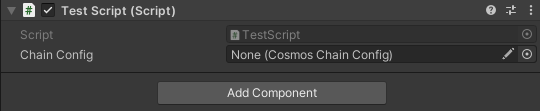

---
# https://vitepress.dev/reference/default-theme-home-page
layout: doc
aside: true
 
---

Advanced use
============

If you want to create your own script, it is possible to link your script to unicosm

## Example

Here is an example of a script to link CosmosConfig script

```c#
using UnityEngine;

public class TestScript : MonoBehaviour
{
    // UniCosm use is here! 
    // Simply add the script to the object and assign CosmosChainConfig 
    public CosmosDev.UniCosm.CosmosChainConfig chainConfig;    
    // Start is called before the first frame update
    void Start() {
        Debug.Log(this.chainConfig._ChainConfiguration.chainName);
        Debug.Log(this.chainConfig._ChainConfiguration.chainId);
        Debug.Log(this.chainConfig._ChainConfiguration.chainDenom);
    }
    // Update is called once per frame
    void Update() {}
}

```

## Result


 
You just need to assign a configuration chain and launch the game, you will see the chain information appear in your debugger  

