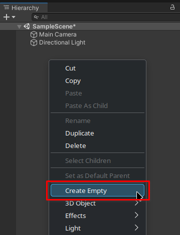
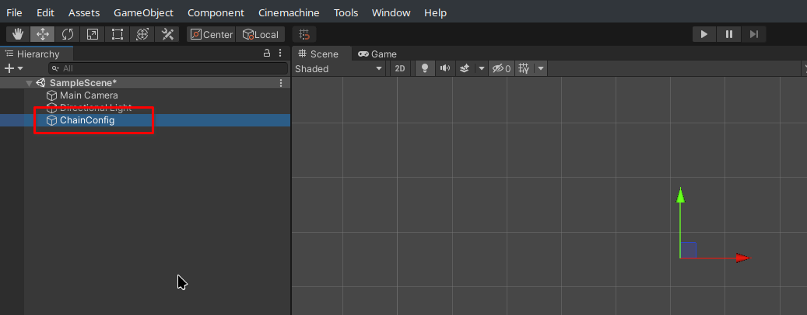
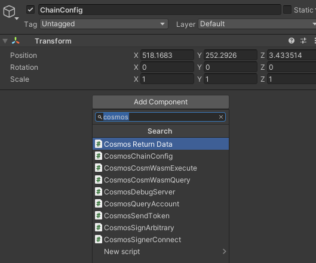

---
# https://vitepress.dev/reference/default-theme-home-page
layout: doc
aside: true
 
---

# Basic use 

To use UniCosm, simply create an object and add a component by searching for "cosmos*"

## Create an objet  

1. Right click in the hierarchy, click on "Create empty"  


2. Name the object: ```ChainConfig``` 



## Assign a script to the object

1. Select the ```ChainConfig``` object in the inspector window
2. Click on "Add component"
3. Select the cosmos script that interests you and configure it by following the documentation of each script




 