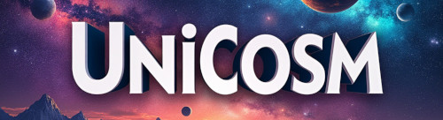
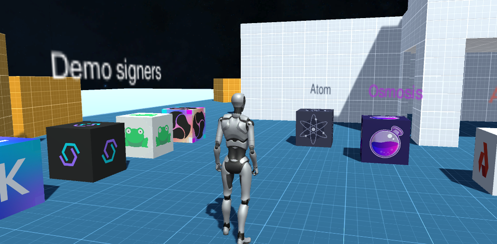

---
# https://vitepress.dev/reference/default-theme-home-page
layout: doc
aside: true

 
---
 
 [{ width=800px }](unicosmbanner.png)
 

What is Unicosm?
============

## Introduction

Unicosm is a package that allows you to connect your unity games to the cosmos SDK blockchain ecosystem

With Unicosmos you will have the possibility to connect your players from the preferred offline signing client!  

Signer available:
| Signer App    | Info |
| -------- | ------- |
| Keplr wallet  | [Link](https://www.keplr.app/get)    |
| Cosmostation | [Link](https://www.cosmostation.io/products/cosmostation_extension) |
| Leap wallet    | [Link](https://www.leapwallet.io/extension) |
 
We have created a whole series of tools that allow you to interact from any chain of the cosmos ecosystem.

## Requirement

To work with Unicosm, you will need somes skills in:

  * Great knowledge in game development on unity (https://learn.unity.com/)
  * A good knowledge of the cosmos sdk (https://docs.cosmos.network/)
  * Lots of imagination!! 

## WebGL
::: info
Unicosm only works with the unity WebGL export.  
The reason is simple: <ins>offline signers are only accessible through the browser.</ins>
:::

To properly configure WebGL on your project, please refer to the corresponding section on the [Webgl Configuration](/quickstart/webgl-configuration.html)
