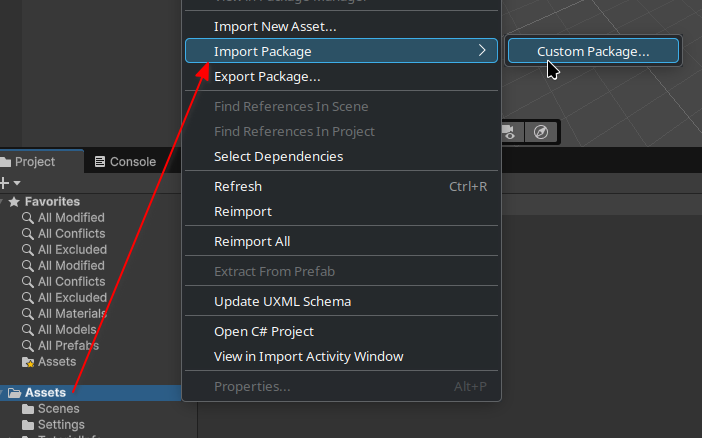
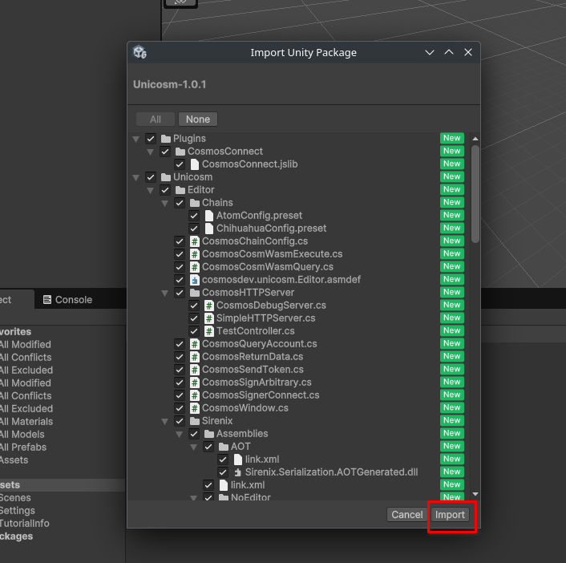

---
# https://vitepress.dev/reference/default-theme-home-page
layout: doc
aside: true
 
---

# Package Installation

## From github

To install Unicosm, follow these steps:

1. Donwload the unitypackage [here](https://github.com/cosmDev/Unicosm/releases/download/1.0.1/Unicosm-1.0.1.unitypackage)
2. Create your Unity project and import the unitypackage from Asset folder

4. Click on Import from the new windows

Well done, your have installed Unicosm 🎉  
Next step: https://cosmdev.github.io/unicosm-doc/quickstart/webgl-configuration.html

## From unity store :hourglass_flowing_sand:

Soon! 

 
