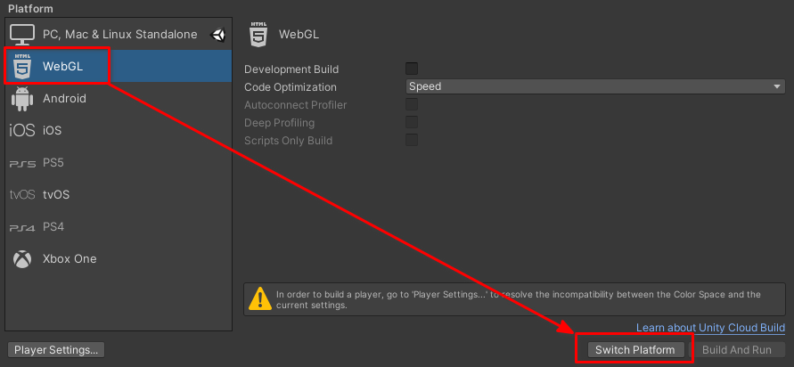
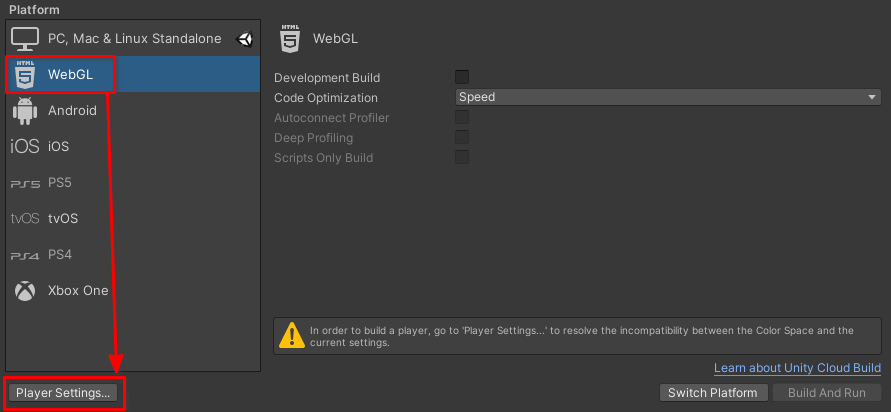
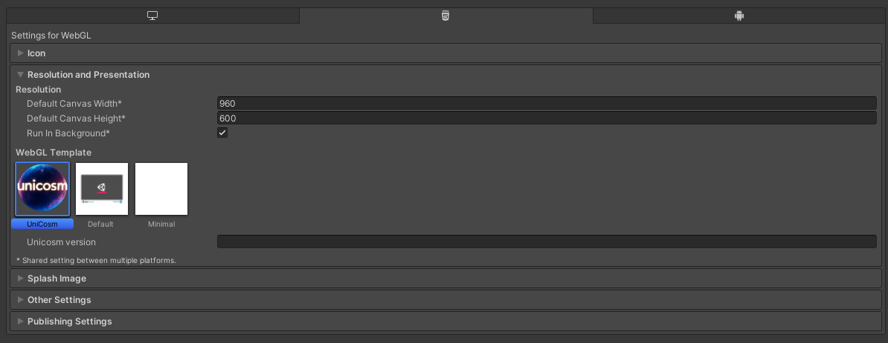

---
# https://vitepress.dev/reference/default-theme-home-page
layout: doc
aside: true
 
---

# WebGl configuration

## Configuration

1. On top menu, open File <Badge type="info" text="->" /> Build Settings
2. Select WebGl and click on switch plateform
  
3. After the last change, select <Badge type="info" text="Player settings" />
 
4. In the "Resolution and presentation" section, select the UniCosm template
  

 