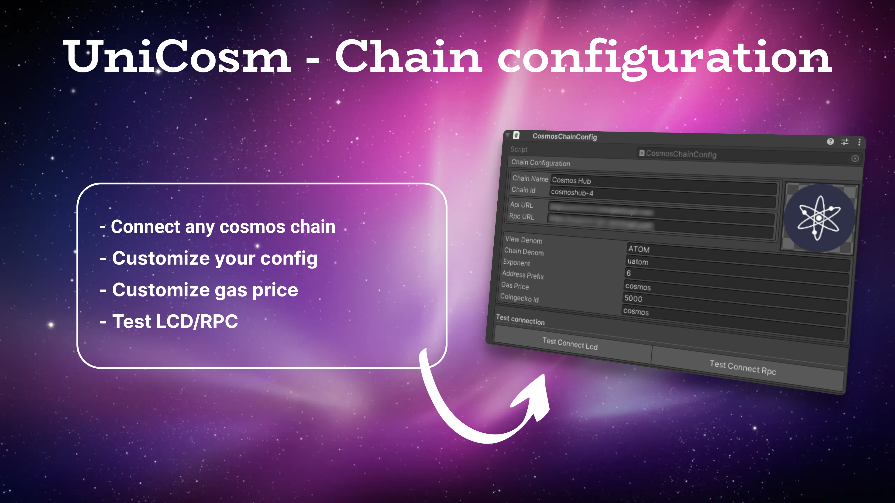
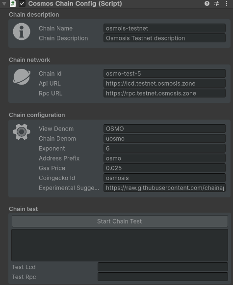

---
layout: doc
aside: false
--- 

 
 
# 🟢 CosmosChainConfig.cs

::: info {icon-type=info}
The CosmosChainConfig script allows you to define the chain configuration you want to use.  
You will need to assign this configuration on each action script of our package  

To manage your chain configuration, we recommend that you select the information on the repo:  
https://github.com/cosmos/chain-registry
:::

<DividePage :top="63">
<template #left>

## Chain Id

The chain id of the chain you want to use

## Chain Name

The chain name of the chain you want to use

## Api URL

The API (or LCD) url of the chain you want to use

## Rpc URL

The RPC url of the chain you want to use

## View Denom

The view denom of the chain you want to use:  
(example: ATOM)

## Exponent

The exponent of the chain you want to use  
(example: 6)

## Address Prefix

The exponent of the chain you want to use  

## Gas Price

The gas price of the chain you want to use  

## Coingecko Id
 
The coingecko Id of the chain you want to use   
(example: cosmos)

## Experimental Suggest Chain

Url to experimentalSuggestChain format:
https://docs.keplr.app/api/suggest-chain.html
 

</template>
<template #right>

</template>
</DividePage>
 
<!-- 
1. First Item
   1. First Item
      1. First Item

{.order-list-I}

::: tip test {icon-type=tip}
test
:::

::: info {icon-type=info}
test
:::

::: info {icon-type=info-bordered}
test
:::

::: warning {icon-type=warning}
test
:::

::: warning {icon-type=warning-bordered}
test
:::

::: danger {icon-type=danger}
test
:::

::: danger {icon-type=danger-bordered}
test
:::

::: info video content {icon-type=video}
demo
:::

::: info video content {icon-type=video-bordered}
demo
::: -->
