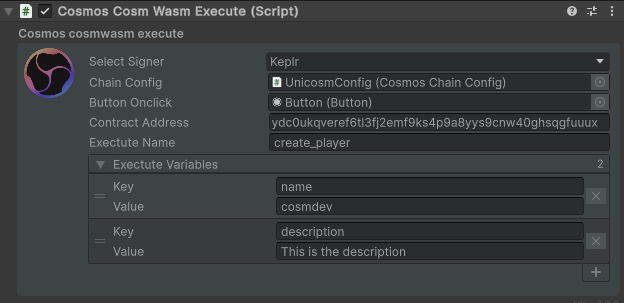

---
layout: doc
aside: false
--- 

<script setup>
  import {DividePage} from 'vitepress-theme-api';
</script>
 
# CosmosCosmWasmExecute.cs

The ```CosmosCosmWasmExecute``` script allows you to execute a smartcontract on the chain configuration you want to use. 
 
::: info {icon-type=info}
Using these scripts will require a minimum knowledge of cosmwasm.  
For this, you can consult the documentation here: https://docs.cosmwasm.com/
:::

 
<DividePage :top="63">
<template #left>

## Select signer <Badge type="info" text="List" />

| Type          |      Supported?         | Info
| ------------- | :-----------:           | :-----------
| Keplr         |   :white_check_mark:    | [Keplr Doc](https://www.keplr.app/get)
| Cosmostation  |   :white_check_mark:    | [Cosmostation Doc](https://www.cosmostation.io/products/cosmostation_extension)
| Leap          |   :white_check_mark:    | [Leap Doc](https://www.leapwallet.io/extension)

## Chain Configuration <Badge type="info" text="Object" />

Add the object containing the script [CosmosChainConfig.cs](/scripts/CosmosChainConfig.cs )

## Button Onclick <Badge type="info" text="Button" />

Add the button you created to your scene to interact with the signer

## Contract address <Badge type="info" text="Text" />

The contract address to exectute

## Exectute name <Badge type="info" text="Int" />

The main exectute to send 

## Exectute variables <Badge type="info" text="Int" />

The sub exectute to send 


</template>


<template #right>


##  Result of the screen  
::: details Click me to toggle the code {open}
```json
{
  create_player: {
    name: "cosmdev",
    description: "This is the description"
  }
}

```
:::
</template>
</DividePage>