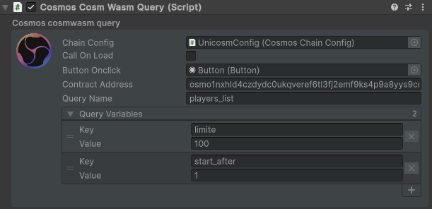

---
layout: doc
aside: false
--- 

<script setup>
  import {DividePage} from 'vitepress-theme-api';
</script>
 
# CosmosCosmWasmQuery.cs

The ```CosmosCosmWasmQuery``` script allows you to query a smartcontract on the chain configuration you want to use. 

::: info {icon-type=info}
Using these scripts will require a minimum knowledge of cosmwasm.  
For this, you can consult the documentation here: https://docs.cosmwasm.com/
:::

<DividePage :top="63">
<template #left>

## Chain Configuration <Badge type="info" text="Object" />

Add the object containing the script [CosmosChainConfig.cs](/scripts/CosmosChainConfig.cs )

## Button Onclick <Badge type="info" text="Button" />

Add the button you created to your scene to interact with the signer

## Call On Load <Badge type="info" text="Bool" />

Runs the query on the smartcontract when loading the object

## Contract address <Badge type="info" text="Text" />

The contract address to query

## Query name <Badge type="info" text="String" />

The main query to send 

## Query variables <Badge type="info" text="Array" />

The sub query to send 


</template>


<template #right>


##  Result of the screen  
::: details Click me to toggle the code {open}
```json
{
  players_list: {
    limite: 10,
    start_after: 2
  }
}

```
:::
</template>
</DividePage>
 
<!-- 
1. First Item
   1. First Item
      1. First Item

{.order-list-I}

::: tip test {icon-type=tip}
test
:::

::: info {icon-type=info}
test
:::

::: info {icon-type=info-bordered}
test
:::

::: warning {icon-type=warning}
test
:::

::: warning {icon-type=warning-bordered}
test
:::

::: danger {icon-type=danger}
test
:::

::: danger {icon-type=danger-bordered}
test
:::

::: info video content {icon-type=video}
demo
:::

::: info video content {icon-type=video-bordered}
demo
::: -->