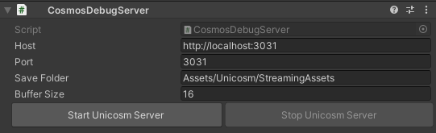
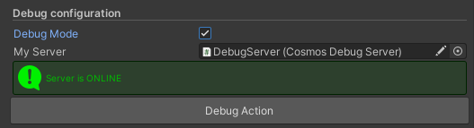
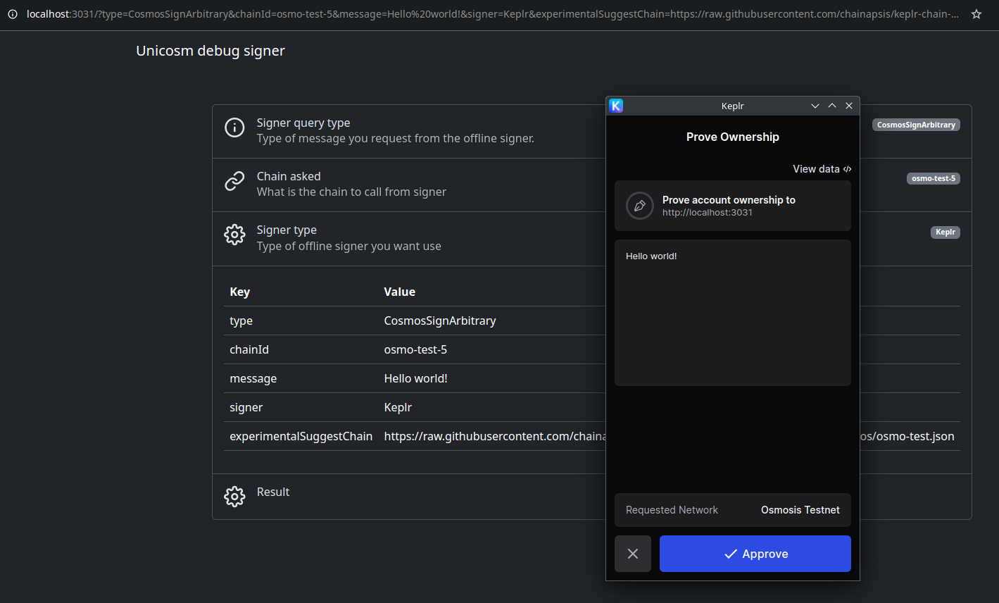

---
layout: doc
aside: false
--- 

<script setup>
  import {DividePage} from 'vitepress-theme-api';
</script>
 
# CosmosDebugServer.cs

The ```CosmosDebugServer``` script allows you to debug the chain configuration you want to use.  
 

<DividePage :top="63">
<template #left>

## Host <Badge type="tip" text="String" />

This is the debug url, it is generated automatically

## Port <Badge type="tip" text="Int" />

This is the port you want to run the server on

## Save Folder <Badge type="tip" text="String" />

This is the folder to use to launch your debug html

## Buffer Size <Badge type="tip" text="Int" />

This is the size of the buffer you want to use
 
</template>
<template #right>



</template>
</DividePage>

## Usage

Once the field configuration is done (you can use the initial configuration)  
You just have to click on the button "Start Unicosm Server"  
And click on "Stop Unicosm Server" to stop the server  

Once the server is started, you can debug any of our scripts by enabling debug mode.




 