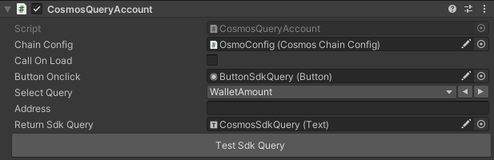

---
layout: doc
aside: false
--- 
<script setup>
  import {DividePage} from 'vitepress-theme-api';
</script>
 
# 🟡 CosmosQueryAccount.cs
 
 

::: info {icon-type=info}
Soon!

The ```CosmosQueryAccount``` script allows you to get data onChain for one address.  
 
:::
 


<DividePage :top="63">
<template #left>

## Chain Configuration <Badge type="tip" text="Object" />

Add the object containing the script [CosmosChainConfig.cs](/scripts/CosmosChainConfig.cs )

## Call On Load <Badge type="tip" text="Bool" />

Runs the query on chain when loading the object

## Button Onclick <Badge type="tip" text="Button" />

Add the button you created to your scene to interact with the signer

## Select Query <Badge type="tip" text="List" />

Select the query to do onchain.  
Currently we support two queries:
1. Amount available
2. Total rewards

## Address <Badge type="tip" text="String" />

This is the address to query.
If the user is already logged in, we use the ```PlayerCosmosAddr``` variable from ```PlayerPrefs``` to retrieve the player's address.

``` C#
PlayerPrefs.GetString("PlayerCosmosAddr");
```
 
</template>
<template #right>



</template>
</DividePage>
 
