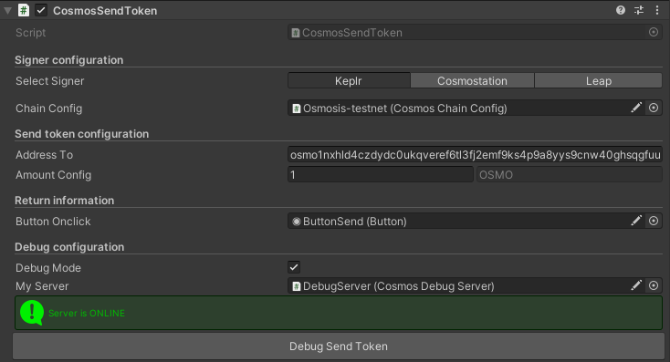

---
layout: doc
aside: false
--- 

<script setup>
  import {DividePage} from 'vitepress-theme-api';
</script>
 
# CosmosSendToken.cs

The ```CosmosSendToken``` script allows you to send token on the chain configuration you want to use. 
 
<DividePage :top="63">
<template #left>

## Select signer <Badge type="tip" text="List" />

| Type          |      Supported?         | Info
| ------------- | :-----------:           | :-----------
| Keplr         |   :white_check_mark:    | [Keplr Doc](https://www.keplr.app/get)
| Cosmostation  |   :white_check_mark:    | [Cosmostation Doc](https://www.cosmostation.io/products/cosmostation_extension)
| Leap          |   :white_check_mark:    | [Leap Doc](https://www.leapwallet.io/extension)

## Chain Configuration <Badge type="tip" text="Object" />

Add the object containing the script [CosmosChainConfig.cs](/scripts/CosmosChainConfig.cs )

## Button Onclick <Badge type="tip" text="Button" />

Add the button you created to your scene to interact with the signer

## Address to <Badge type="tip" text="Text" />

Add to send the token (usualy your address)

## Amount <Badge type="tip" text="Int" />

Amount to send on the address to
 
</template>
<template #right>



</template>
</DividePage>
 
 