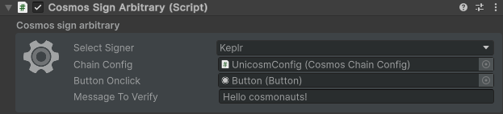

---
layout: doc
aside: false
--- 

<script setup>
  import {DividePage} from 'vitepress-theme-api';
</script>
 
# CosmosSignArbitrary.cs

The ```CosmosSignArbitrary``` script allows you to define the chain configuration you want to use.
You will need to assign this configuration on each action script of our package

::: info {icon-type=info}
adr-036 
https://docs.cosmos.network/main/build/architecture/adr-036-arbitrary-signature
:::

<DividePage :top="63">
<template #left>

## Select signer <Badge type="tip" text="List" />

| Type          |      Supported?         | Info
| ------------- | :-----------:           | :-----------
| Keplr         |   :white_check_mark:    | [Keplr Doc](https://www.keplr.app/get)
| Cosmostation  |   :white_check_mark:    | [Cosmostation Doc](https://www.cosmostation.io/products/cosmostation_extension)
| Leap          |   :white_check_mark:    | [Leap Doc](https://www.leapwallet.io/extension)

## Chain Configuration <Badge type="tip" text="Object" />

Add the object containing the script [CosmosChainConfig.cs](/scripts/CosmosChainConfig.cs )

## Button Onclick <Badge type="tip" text="Button" />

Add the button you created to your scene to interact with the signer

## Message to verify <Badge type="tip" text="Text" />

Add the button you created to your scene to interact with the signer

 
</template>
<template #right>



</template>
</DividePage>
 
<!-- 
1. First Item
   1. First Item
      1. First Item

{.order-list-I}

::: tip test {icon-type=tip}
test
:::

::: info {icon-type=info}
test
:::

::: info {icon-type=info-bordered}
test
:::

::: warning {icon-type=warning}
test
:::

::: warning {icon-type=warning-bordered}
test
:::

::: danger {icon-type=danger}
test
:::

::: danger {icon-type=danger-bordered}
test
:::

::: info video content {icon-type=video}
demo
:::

::: info video content {icon-type=video-bordered}
demo
::: -->