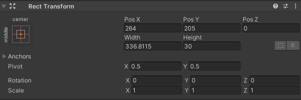

---
# https://vitepress.dev/reference/default-theme-home-page
layout: doc
aside: true
 
---

# Cosmos login
::: info {icon-type=info}
This tutorial aims to connect a cosmos user to your unity game.
:::
 

## Create your canvas

In hierarchy, right click <Badge type="info" text="->" /> UI <Badge type="info" text="->" /> Panel.  
In Canvas, right click <Badge type="info" text="->" /> Create empty and name it ```UnicosmModal```.  
Right click on Panel <Badge type="info" text="->" /> UI <Badge type="info" text="->" /> Button.  

 
 
## Configure your chain

In hierarchy, right click <Badge type="info" text="->" /> Create empty and name it ```chainConfig```.  
Select ```CosmosChainConfig``` and configure your chain information.

More information here: [CosmosChainConfig.cs](/scripts/CosmosChainConfig.cs.html) 

## Create your first script

In your asset window, right click <Badge type="info" text="->" /> create C# script and name it ```UnicosmTuto1```.  
Add the following code.  

```c#
using System.Collections;
using System.Collections.Generic;
using UnityEngine;

public class UnicosmTuto1 : MonoBehaviour
{
    public GameObject Canvas;

    void Start()
    {
        Cursor.lockState = CursorLockMode.Locked;
        Canvas.SetActive(false); 
    }
    void Update()
    {
        if (Input.GetKeyDown(KeyCode.Escape))
        {
            Debug.Log("Escape key was pressed.");
            Cursor.visible = true;
            Canvas.SetActive(true); 
            Cursor.lockState = CursorLockMode.None;            
        }

        if (Input.GetKeyUp(KeyCode.Escape))
        {
            Debug.Log("Escape key was released.");
            Cursor.visible = false;
            Canvas.SetActive(false); 
            Cursor.lockState = CursorLockMode.Locked;
        }
    }
}
```

Save the file.  
Click on the ```UnicosmModal``` object and add the "Unicosm tuto" script.  

 

Once the component is added, you just need to drag the ```Panel``` object into the Canvas field of your component.  
 
Click on the ```UnicosmModal``` object and search ```CosmosSignerConnect```. 
Add the component.  

 

Drag the ```ChainConfig``` objet in the field "chain config".  
Drag the ```Button``` object into the "Button onclick" field.  

 

You can already export/build your game. (File <Badge type="info" text="->" /> Build and run)  
Once the game is launched, just click on the escape key and click on the button!  

You will see the offline signer window that you will have selected on the requested blockchain.  

 

## Return the data

At this point, you can connect with an offline signer but you have no data return!  
The goal here will be to retrieve the user's address that the offline signer returns to us.  

For this, we have coded a script (```CosmosReturnData.cs```) that you must use as an example.   
It is important to understand that this file must be coded by the game developer according to his needs.  

Create an object in "Canvas" and name it ```CosmosReturnData```.  

From the ```CosmosReturnData``` object, right click <Badge type="info" text="->" /> UI <Badge type="info" text="->" /> Text and name it ```CosmosReturnAddress```.  

Select the ```CosmosReturnData``` object and add the "Cosmos Return Data" component.  

In the "Return address" field, drag the "CosmosReturnAddress" object.  
Click on the ```CosmosReturnAddress``` object and in the "Rect transformation" part, put the following information:  

 

## Build and run

Now save your project and build your game.  
Once the game is launched, click on escape and click on the button, you will see the user's address displayed at the top right!


Well done! 🎉  
You have just connected a Cosmos blockchain to a Unity game!!