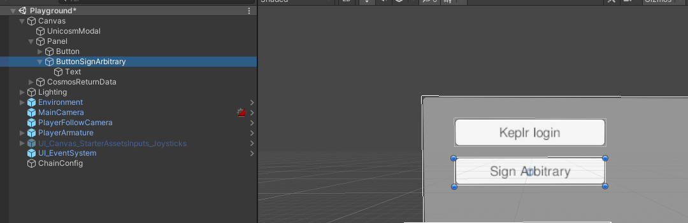
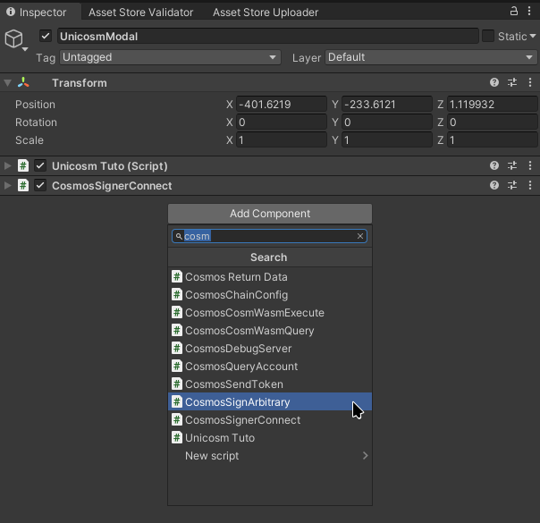
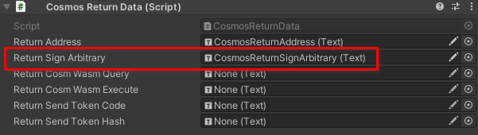
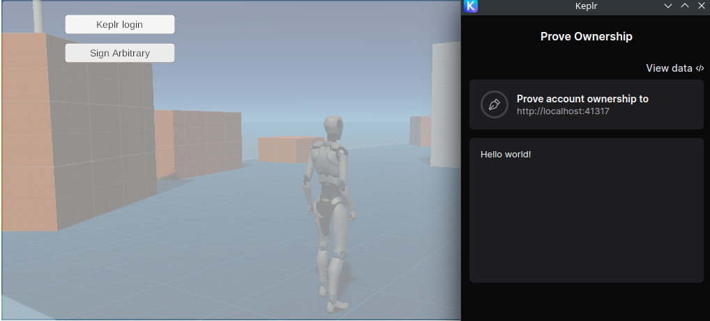

---
# https://vitepress.dev/reference/default-theme-home-page
layout: doc
aside: true
 
---

# Cosmos Sign Arbitrary
::: info {icon-type=info}
This tutorial aims to use CosmosSignArbitrary and prove that the user is the owner of the wallet.  

More info here:  
adr-036 https://docs.cosmos.network/main/build/architecture/adr-036-arbitrary-signature
:::
 
## Create your canvas

1. In Canvas/Panel, right click <Badge type="info" text="->" /> UI <Badge type="info" text="->" /> Button
2. Name the button: ```ButtonSignArbitrary```
3. Place it correctly on your scene



## Assign the script

Click on ```UnicosmModal``` object and add component: ```CosmosSignArbitrary```



1. Drag the ```ChainConfig``` objet in the field "chain config".  
2. Drag the ```ButtonSignArbitrary``` object into the "Button onclick" field.  

## Return the data

1. Right Click on ```CosmosReturnData``` <Badge type="info" text="->" /> UI <Badge type="info" text="->" /> Text and name it: ```CosmosReturnSignArbitrary```
2. In ```CosmosReturnData``` object, assign ```CosmosReturnSignArbitrary``` in "Cosmos Sign Arbitrary"



## Build and run

Now save your project and build your game.  
Once the game is launched, click on escape and click on the "Sign Arbitrary" button, you will see the "Prove Ownership" signer windows.

 