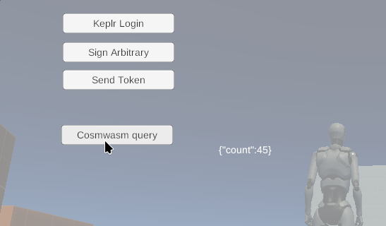

---
# https://vitepress.dev/reference/default-theme-home-page
layout: doc
aside: true
 
---

# Cosmwasm query

::: info {icon-type=info}
This tutorial aims to perform a query on a smartcontract to display the result in your game.
:::
 
## Create your canvas

1. In Canvas/Panel, right click <Badge type="info" text="->" /> UI <Badge type="info" text="->" /> Button
2. Name the button: ```ButtonCosmwasmQuery```
3. Place it correctly on your scene
 


## Assign the script

Click on ```UnicosmModal``` object and add component: ```CosmosCosmwasmQuery```


1. Drag the ```ChainConfig``` objet in the field "chain config".  
2. Drag the ```ButtonCosmwasmQuery``` object into the "Button onclick" field.  

## Configure your query

To try to query a smartcontract, we deploy a basic smartcontract (increment).  
You can find the source here: https://github.com/CosmWasm/cw-template

We have instantiated it on osmosis testnet 5. So let's get the right configuration!

Contract address: ```osmo1nxhld4czdydc0ukqveref6tl3fj2emf9ks4p9a8yys9cnw40ghsqgfuuux```  
Query name: ```get_count```


## Return the data

1. Right Click on ```CosmosReturnData``` <Badge type="info" text="->" /> UI <Badge type="info" text="->" /> Text and name it: ```CosmosReturnWasmQuery```
2. In ```CosmosReturnData``` object, assign ```CosmosReturnWasmQuery``` in "Return Cosm Wasm Query"


## Build and run

Now save your project and build your game.  
Once the game is launched, click on escape and click on the "Cosmwasm query" button, you will see the result of the smartcontract!

  