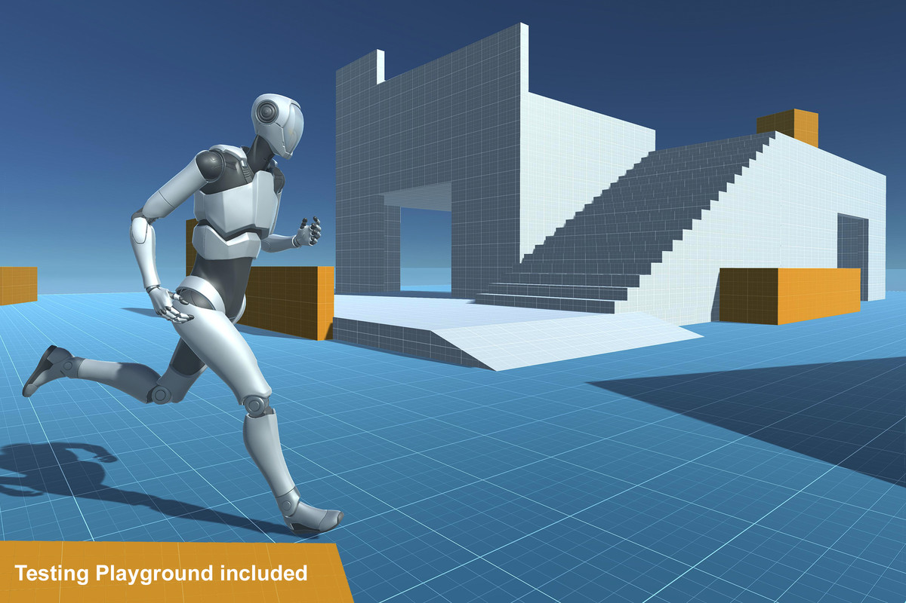
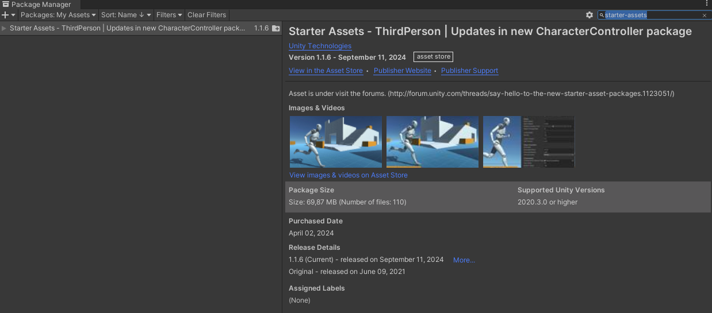

---
# https://vitepress.dev/reference/default-theme-home-page
layout: doc
aside: true
 
---

# Starter pack


 [{ width=800px }](img/tuto2.jpg)

For all the tutorials you find here, we will base ourselves on the basic template of unity.  
This template is free, free and royalty-free.  
 
Once the installation is done and the demo scene is open, you can start the tutorials  

## Get the package

1. Go to https://assetstore.unity.com/packages/essentials/starter-assets-thirdperson-updates-in-new-charactercontroller-pa-196526
2. Buy it (It's free!)

## Install package

1. Create a new project
2. Go to <Badge type="info" text="->" /> Windows <Badge type="info" text="->" /> Packages manager
3. In "My Assets", search: ```starter-assets```



4. At the bottom right of the window, click on "Download" and "Import"
5. Open: ```Assets/StarterAssets/ThirdPersonController/Scenes/Playground.unity```
